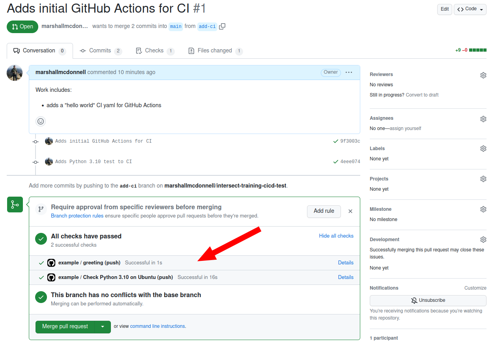

:::::::::::::::::::::::::::::::::::::: questions 

  - How do I setup CI for a Python package in GitHub Actions?


::::::::::::::::::::::::::::::::::::::::::::::::

::::::::::::::::::::::::::::::::::::: objectives

  - Learn about the Actions for GitHub Actions
  - Learn basic setup for Python package GitHub Actions

::::::::::::::::::::::::::::::::::::::::::::::::


# Setup Python project

For this episode, we will be using some of the material
from the [INTERSECT packaging carpentry](https://intersect-training.org/packaging)

# Setup CI

Now we will switch from setting up a general CI pipeline
to more specifically setting up CI for our Python package needs.

But first...

::::::::::::::::::::::::::::::::::::: challenge 

## Activity: What do we need in CI for a Python package project?

What are some of the things we want to automate checks for in CI for a Python Package?

What tools accomplish these checks?

::::::::::::::::::::::::::::::::::::: solution 

## Solution
Just some suggestions (not comprehensive):
* Testing passes ([pytest][pytest] for unit testing or [nox][nox] for parallel Python environment testing)
* Code is of quality (i.e. [ruff][ruff] or [flake8][flake8] for [linting][lint] or [mccabe][mccabe] for reducing [cyclomatic complexity][cc])
* Code conforms to project formatting guide (i.e. [black][black] for formatting)
* Code testing coverage does not drop significanly (i.e. [pytest-cov][pytest-cov] or [Coverage.py][coverage])
* Static type checking (i.e. [mypy][mypy] )
* Documentation builds (i.e. [sphinx][sphinx] )
* Security vulnerabilities (i.e. [bandit][bandit])

:::::::::::::::::::::::::::::::::::::

::::::::::::::::::::::::::::::::::::::::::::::::


::::::::::::::::::::::::::::::::::::: callout 

## CI development
When you are first starting out setting up CI, don't feel you need to add all the checks at the beginning of a project.
First, pick the ones that are  "must haves" or easier to implement.
Then, iteratively improve your pipeline.

::::::::::::::::::::::::::::::::::::::::::::::::

## Setup Python environment in CI 

As of right now, your `.github/workflows/main.yml` YAML file should look like
```yaml
name: Code Checks
on: push
jobs:
  greeting:
    runs-on: ubuntu-latest
    steps:
      - name: Greeting!
        run: echo hello world
```

Overall, we will want to get our CI to run our unit tests via [pytest][pytest].
But first, let's figure out how to setup a Python environment.

Let's change the name from `example` to `Code Checks` to better reflect what we will be doing.

We will add another job (named `test-python-3-10`)
and add the steps to setup a Python 3.10 environment to our YAML file:

```yaml
name: Code Checks
on: push
jobs:
  greeting:
    runs-on: ubuntu-latest
    steps:
      - name: Greeting!
        run: echo hello world

  test-python-3-10:
    name: Check Python 3.10 on Ubuntu
    runs-on: ubuntu-latest
    steps:
      - uses: actions/checkout@v3

      - uses: actions/setup-python@v4
        with:
          python-version: "3.10"
```

You might be asking: _"What is going on with the `uses` command?"_

Here, we are using what GitHub calls ["Actions"][actions].
These are custom applications that,
quoted from the documation link above,
 _"...performs a complex but frequently repeated task."_

Second, you might ask: _"Okay... but what is it doing?"_

We won't go into too much detail but mainly, `actions/checkout@v3` checks out your code. 
This one is used all the time.

::::::::::::::::::::::::::::::::::::: callout 

## GitHub Acions Marketplace
GitHub has what they call a ["Marketplace" for "Actions"][marketplace-actions] where you can search for reusable tasks.

::::::::::::::::::::::::::::::::::::::::::::::::

There is a Marketplace page for `actions/checkout` ([Marketplace page][actions-checkout-marketplace]]) and also a GitHub repository for the source code ([GitHub][actions-checkout-github]).

The `@v3` in `actions/checkout@v3` signifies which version of the `actions/checkout` to use.

So...

::::::::::::::::::::::::::::::::::::: challenge 

## Activity: What does the `setup-python` Action do?

What do you think the `actions/setup-python` does?

Can you find the Marketplace page for `actions/setup-python`?

Can you find the GitHub repository for `actions/setup-python`?

*Bonus:* Can you find a file in the GitHub repo that gives you all the `with` options?

::::::::::::::::::::::::::::::::::::: solution 

## Solution
* This action helps install a version of Python along with other options
* Marketplace: [https://github.com/marketplace/actions/setup-python](https://github.com/marketplace/actions/setup-python)
* GitHub repository: [https://github.com/actions/setup-python][actions-setup-python-github]
* *Bonus:* This will be in the `actions.yml`. Here is the `@v4` version of `actions.yml`: [link](https://github.com/actions/setup-python/blob/v4/action.yml).

:::::::::::::::::::::::::::::::::::::

::::::::::::::::::::::::::::::::::::::::::::::::

## Running your unit tests via CI

We now have our Python environment setup in CI.
Let's add running our tests!

```yaml
name: Code Checks
on: push
jobs:
  greeting:
    runs-on: ubuntu-latest
    steps:
      - name: Greeting!
        run: echo hello world

  test-python-3-10:
    name: Check Python 3.10 on Ubuntu
    runs-on: ubuntu-latest
    steps:
      - uses: actions/checkout@v3

      - uses: actions/setup-python@v4
        with:
          python-version: "3.10"

      - name: Install package
        run: python -m pip install -e .[test]

      - name: Test package
        run: python -m pytest
```

We see that we are installing our Python package
with the test dependencies and then running `pytest`,
just like we would locally.

Let's push it and see our new CI for Python!

```bash
git add .github/workflows/main.yml
git commit -m "Adds Python 3.10 test to CI"
git push
```

Checkout the results! We see that we now have two jobs running!:

{alt='Displays the results of Python CI Actions'}

We can see the output / results from running `pytest`:


Similarly, we see our open Pull Request has updated dynamically with updates!

{alt='Displays the results of Python CI Actions on the Pull Request'}


::::::::::::::::::::::::::::::::::::: challenge 

## Activity: Running multiple jobs

Did the jobs run in sequence or in parallel?

::::::::::::::::::::::::::::::::::::: solution 

## Solution
Parallel. We will discuss this more when we get to the CD section.

:::::::::::::::::::::::::::::::::::::

::::::::::::::::::::::::::::::::::::::::::::::::


::::::::::::::::::::::::::::::::::::: keypoints 

  - GitHub has a Marketplace of reusable Actions
  - CI can help automated running tests for code changes to your Python package

::::::::::::::::::::::::::::::::::::::::::::::::